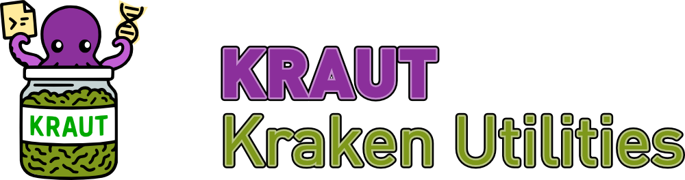
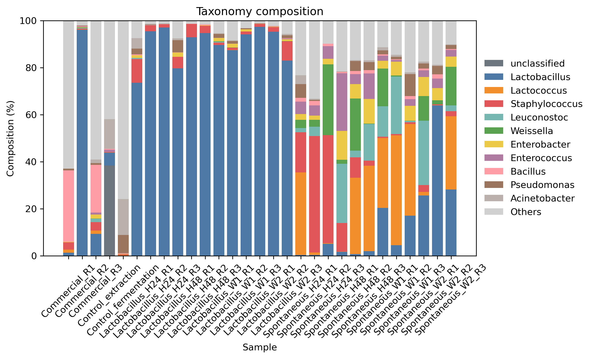
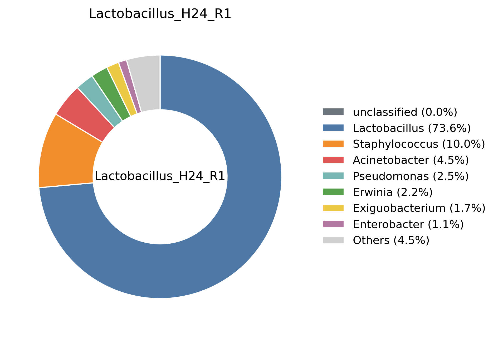
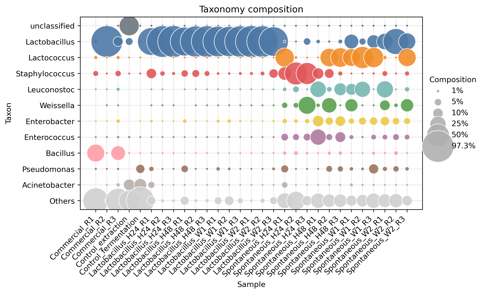

# Kraut Overview

[Overview](index.md) | [Installation](installation.md) | [Commands](commands.md)

**Kraut** (packaged as `krautils`) is a Python toolset for parsing, merging, and analyzing Kraken2 taxonomic reports. It provides a suite of commands to handle single reports, merge multiple datasets, generate abundance tables, calculate alpha diversity, and create interactive or static visualizations.

## Key Features

- **Standardization**: Convert and filter Kraken2 reports into consistent formats.
- **Aggregation**: Merge multiple samples into a single comparative table.
- **Diversity Analysis**: Calculate alpha diversity metrics (Shannon, Simpson, etc.) directly from reports.
- **Visualization**: Generate high-quality composition plots (stacked bars, bubble charts) in HTML or static formats (PNG, SVG, PDF).
- **Flexibility**: Support for both cumulative (TOT) and taxon-specific (LVL) metrics.

## Example Visualizations

### Multi-sample Stacked Bar Chart

### Single-sample Composition

### Bubble Chart

